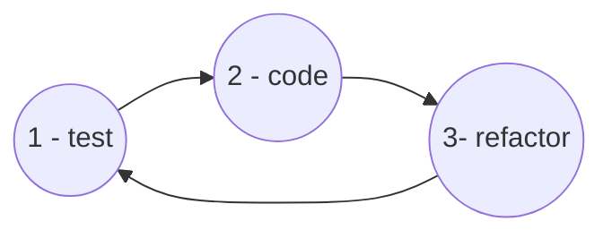

# About

Personal annotation of the course [TDD – Desenvolvimento de Software Guiado npor Testes](https://www.coursera.org/learn/tdd-desenvolvimento-de-software-guiado-por-testes) at Coursera.

# What is a high quality software?

- **Wrote for developer**
- **Clean code**:
    * Easy to read
    * Easy to understand
    * Easy to change

## Principals of a high quality code

- **KISS**: keep It Simple, Stupid! The solutions must be the more simple as it could be.
- **YAGNI**: You Aren't Gonna Need It! Do not anticipate code that you don't use now.
- **DRY**: Don't Repeat your self! Avoid duplicate code.
- **TDA**: Tell, Don't Ask! We do not change a attribute/data of a class B from a class A. Instead, the class A must tell to the class B to deal with her own data.

- **LoD**: Law of Demeter. We don't want to work with the "friend of my friend". I mean, if a class A needs class B, and class B needs class C, the class A do not need to know about class C.

- **SOLID principals**

- **Express the intention**: the name of variables, function, methods ans tests gave a hint about intention.

- **Design Patterns**

- **GRASP**: General Responsibility Assignment Software Principals.

# TDD: a approach to build high qualify code

**TDD** is a acronym for *Test Driven Development*.

TDD isn't a test technique. It is a software development technique where we make the tests before to design the code of our application.

## TDD cicles

- **test**: write a failing test.
- **code**: make the test pass.
- **refactor**: improve your code.

## 1 - Adding a test

Add a test to:

- Design the class interface
- Define the expected behavior

## 2 - Make the test pass

Make the test pass by:

- Implementing the class behavior
- Doing the simplest/dummy solution

## 3 - Refactor

Improve your code applying principals of a high quality code like SOLID, Design Patterns, etc. Please see [Refactoring Guro](https://refactoring.guru/pt-br/).

Basically:

- Clean your code
- Improve your class design

## Baby Steps

You must to add little behavior from one test to another.

Baby steps do not mean slow development, but often switch between tests and application code.